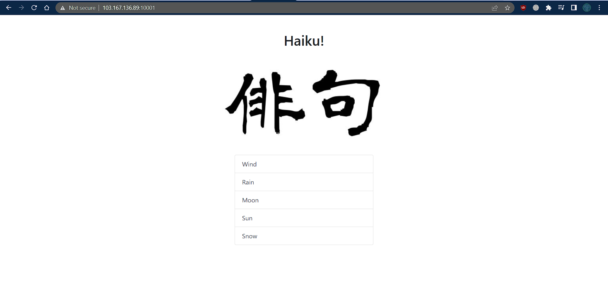
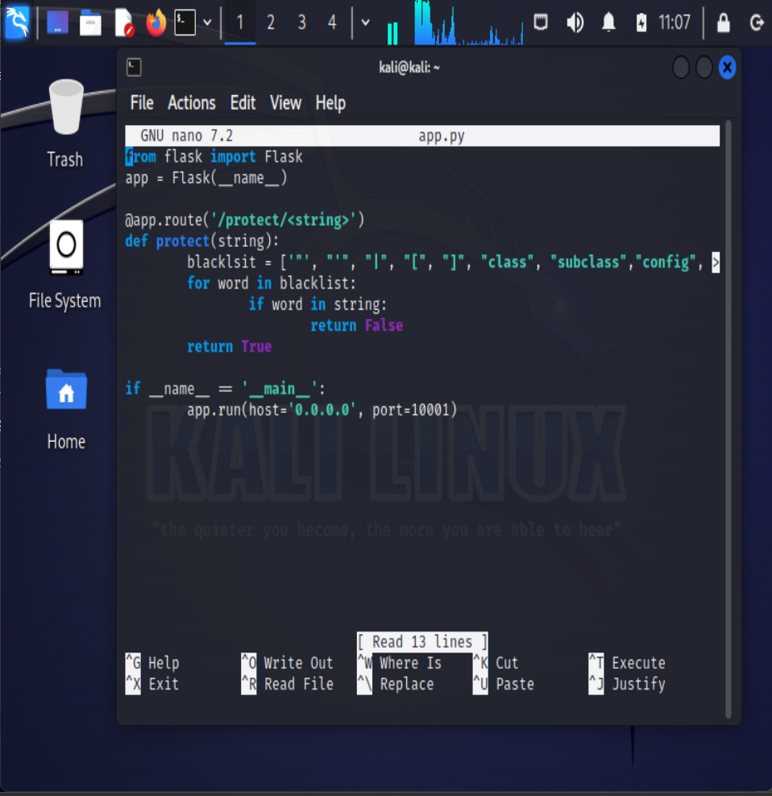
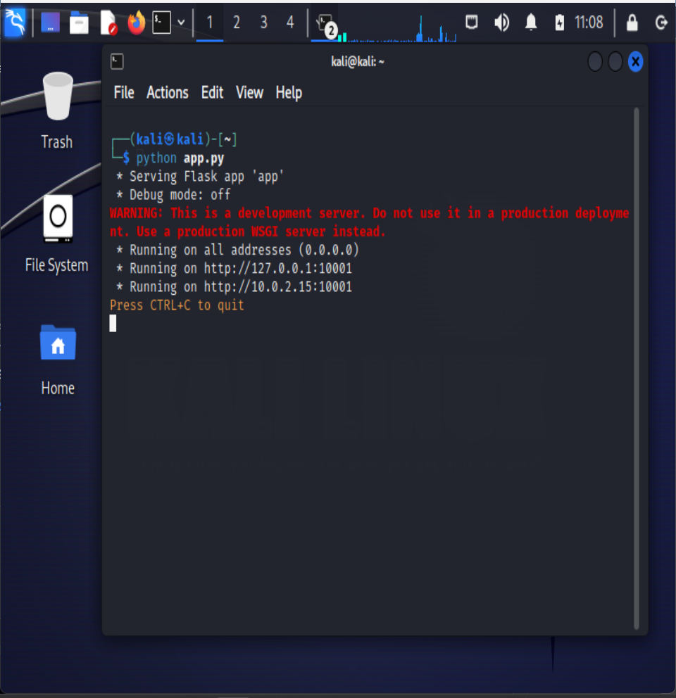

# Fortune Cookies
> Have you ever heard of haikus?
> http://103.167.136.89:10001/

## About the Challenge
Diberikan sebuah link Website yang memunculkan beberapa Haiku



## Incomplete Solution
Berdasarkan hint challenge dapat disimpulkan bahwa diperlukan penjalanan kode spesifik pada source code website yang mana saat dijalankan akan menghasilkan flag.

Pertama-tama, saya menjalankan kali linux dan membuat kode yang tertera pada hint 1



Namun, Saat menjalankan kode tersebut, sepertinya kode tersebut hanya berjalan ke link default kali dimana seharusnya dijalankan ke link http://103.167.136.89:10001/



Saat ini saya masih belum bisa mendapatkan flag dari Challenge ini

```shell
ForestyHC{?????}
```
